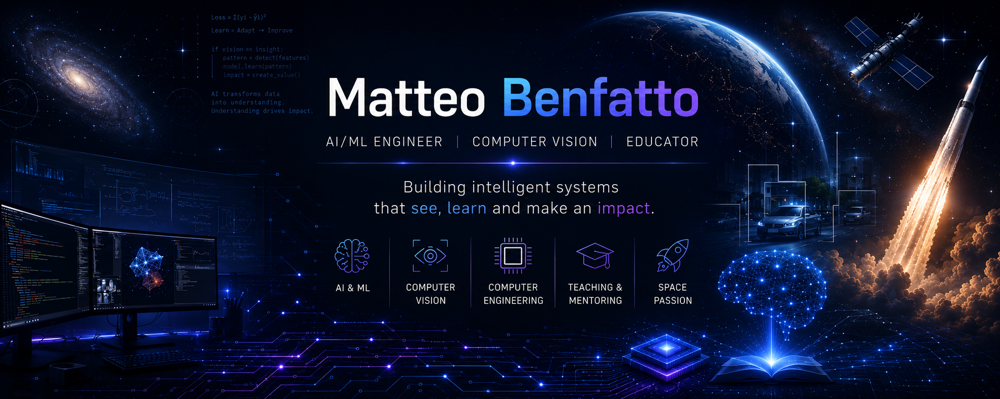
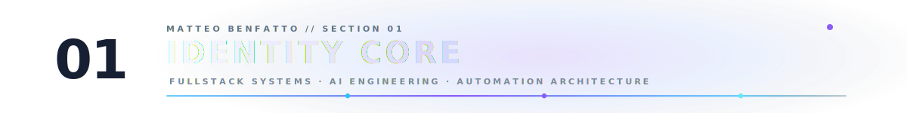
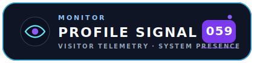
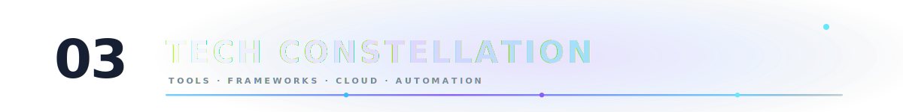
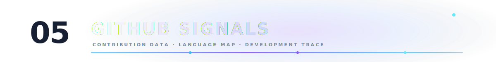
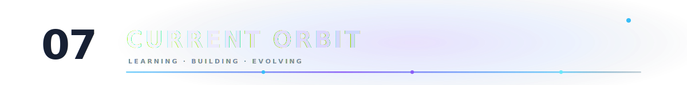

<!-- HERO -->
<div align="center">



<br/><br/>


<br/><br/>
<br/>

<div align="center">



</div>

<br/>


<br/><br/>


<br/>

<a href="https://linkedin.com/in/matteobenfatto97">
  
</a>
&nbsp;
<a href="https://github.com/matteobenfatto97">
  
</a>
&nbsp;
<a href="mailto:matteo.benfatto97@gmail.com">
  
</a>
<br/>

<div align="center">
  
</div>
<br/>
</div>
<div align="center">

</div>

```ts
const matteo: DeveloperProfile = {
  name: "Matteo Benfatto",
  role: "Fullstack Developer & AI Engineer",
  location: "Italy",

  mindset: "build fast, automate deeply, think systemically",

  specialization: [
    "AI-powered applications",
    "Fullstack product development",
    "Automation systems",
    "API-first architectures",
    "Cloud-ready software"
  ],

  stack: {
    languages: ["Python", "TypeScript", "JavaScript"],
    frontend: ["React", "Next.js", "Tailwind CSS"],
    backend: ["FastAPI", "Node.js", "REST APIs"],
    data: ["PostgreSQL", "Redis", "MongoDB"],
    devOps: ["Docker", "GitHub Actions", "Linux"],
    ai: ["LLMs", "AI Agents", "Automation Pipelines"]
  },

  mission:
    "turn complex ideas into elegant, intelligent and scalable software",
};
```

<div align="center">
<div align="center">
  
</div>


</div>

<div align="center">
  
</div>

<div align="center">

> My stack is not a random collection of tools.  
> It is the constellation I use to build intelligent software, AI systems, machine vision pipelines and scalable digital products.

<br/>


<br/>


<br/><br/>


<br/>


<br/><br/>


<br/>


<br/><br/>


<br/>


<br/><br/>


<br/>


<br/><br/>


<br/>


<br/><br/>


<br/>


</div>


<div align="center">
  
</div>

<div align="center">


</div>


<div align="center">



<br/>


<br/><br/>

<sub>GitHub activity data may be cached by external rendering services.</sub>

</div>


<div align="center">
  
</div>

```txt
> Think in systems.
> Build in iterations.
> Automate the boring.
> Polish the meaningful.
> Make software feel alive.
```

I like software that is not just technically correct, but useful, elegant and alive.

Good engineering means connecting logic, design and purpose:  
a clean interface, a solid architecture, an intelligent workflow and a real problem solved.


<div align="center">
  
</div>

```yaml
learning:
  - advanced AI engineering
  - software architecture
  - automation design
  - scalable backend systems

building:
  - AI-powered productivity tools
  - fullstack applications
  - API-first products
  - automation workflows

obsessed_with:
  - elegant code
  - intelligent systems
  - fast execution
  - meaningful products
```


<br/>

<div align="center">


</div>
